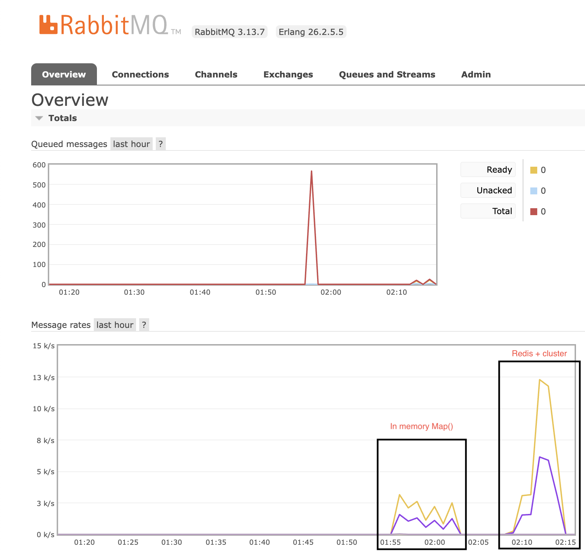

# RabbitMQ RPC with HTTP Interface (Cluster Mode + Redis)

Demonstration of an **RPC-based messaging system** using RabbitMQ, Node.js, Redis, and Express.js HTTP server. It now supports **multi-core scalability** using **Node.js cluster mode** and integrates Redis for managing pending request states across distributed workers.


## Architecture Diagram

```plaintext
+-----------+        +-------------------+        +------------+
| HTTP Client| ----> | HTTP Server (Node)| ---->  | RabbitMQ   |
|           |        | (Cluster Workers) |        | (RPC Queue)|
+-----------+        +-------------------+        +------------+
                                   |
                                   v
                             +----------+
                             |   Redis   |
                             | (Request  |
                             |  Tracking)|
                             +----------+
```

## Why redis?


### Compared with in-memory Map() based solution



## Features
- **Asynchronous RPC Pattern**: Processes messages via RabbitMQ and responds to HTTP requests.
- **Redis Integration**: Centralized state management using Redis for pending request tracking.
- **Cluster Mode**: Leverages all available CPU cores for concurrent HTTP request handling.
- **Request-Response Handling**: Ensures each HTTP request gets a unique RabbitMQ response with fault tolerance.
- **Scalable Design**: Supports multiple RabbitMQ consumers and concurrent HTTP requests across multiple workers.

---

## Prerequisites
1. **Docker** and **Docker Compose** installed.
2. **Node.js** (v14 or later) and **npm** installed.

---

## Setup

1. Clone the repository:
   ```bash
   git clone <repository-url>
   cd <repository-folder>
   ```

2. Start RabbitMQ and Redis using Docker Compose:
   ```bash
   make docker-up
   ```

3. Install Node.js dependencies:
   ```bash
   npm install
   ```

4. Create a `.env` file for environment variables:
   ```bash
   cp .env.example .env
   ```

---

## RabbitMQ and Redis Access

### RabbitMQ Management UI
- **URL**: [http://localhost:15672](http://localhost:15672)
- **Username**: `guest`
- **Password**: `guest`

### Redis CLI Access
To interact with Redis:
```bash
docker exec -it redis redis-cli
```

Example commands:
```bash
127.0.0.1:6379> keys *
127.0.0.1:6379> get <correlation_id>
```

---

## Usage

### Start Servers
1. **Start RPC Server**:
   ```bash
   make start-rpc
   ```

2. **Start HTTP Server in Cluster Mode**:
   The HTTP server now runs in **cluster mode**, utilizing all CPU cores:
   ```bash
   make start-http
   ```

### Test Endpoint
Send a test HTTP request to the `/process` endpoint:
```bash
curl -X POST -H "Content-Type: application/json" -d '{"input": "foo"}' http://localhost:3000/process
```

Expected Response:
```json
{
    "result": "foo bar"
}
```

---

## Load Testing
Run the load test script to benchmark the system:
```bash
node load_test.js
```

### Example Output
```plaintext
Starting load test...
Load test completed.
========== RESULTS ==========
Requests per second: 500
Average latency (ms): 25
Failed requests: 0
=============================
```

---

## Cleanup
Stop all services and clean up resources:
```bash
make clean
```

---

## Key Enhancements

### Redis Integration
- Replaces the in-memory `Map` with Redis for tracking pending requests.
- Ensures state persistence and fault tolerance, even in distributed setups.
- Uses a TTL (time-to-live) of 30 seconds for automatic cleanup of stale requests.

### Cluster Mode
- Uses **Node.js cluster module** to utilize all available CPU cores.
- Automatically restarts workers in case of failure.
- Ensures high availability and scalability for HTTP request handling.

### Scalability Suggestions
1. **Increase RabbitMQ Consumers**:
   Run multiple `rpc_server.js` instances to scale message processing.

2. **Load Balancing**:
   Use a load balancer (e.g., NGINX) in front of the HTTP servers to handle increased traffic.

3. **Monitoring**:
   - Monitor RabbitMQ queues using the management UI.
   - Monitor Redis key usage and expiration using `redis-cli`.

